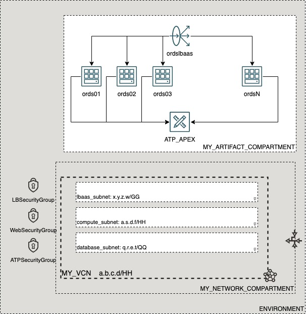

# OCI Cloud Bricks: Linux Compute Instance

[](https://img.shields.io/badge/license-UPL-green) [](https://sonarcloud.io/dashboard?id=oracle-devrel_terraform-oci-cloudbricks-linux-compute)

## Introduction
The following cloud brick enables you to create a fully managed APEX with IaaS Enabled ORDS Fixed amount of Servers

## Reference Architecture
The following is the reference architecture associated to this brick



### Prerequisites
- Pre existent Compartment structure
- Pre existent VCN, Subnets for Database, Computes and LBaaS

--- 

## Sample tfvar file

If Flex Shape is in use

```shell
########## FLEX SHAPE IS IN USE ##########
########## SAMPLE TFVAR FILE ##########
########## PROVIDER SPECIFIC VARIABLES ##########
region           = "foo-region-1"
tenancy_ocid     = "ocid1.tenancy.oc1..abcdefg"
user_ocid        = "ocid1.user.oc1..aaaaaaabcdefg"
fingerprint      = "fo:oo:ba:ar:ba:ar"
private_key_path = "/absolute/path/to/api/key/your_api_key.pem"
########## PROVIDER SPECIFIC VARIABLES ##########


########## ARTIFACT SPECIFIC VARIABLES ##########****
ssh_public_key                   = "./relative/path/to/ssh/key/public_ssh_key.pub"
ssh_private_key                  = "./relative/path/to/ssh/key/private_ssh_key"
ssh_public_is_path               = true
ssh_private_is_path              = true
compute_availability_domain_list = ["aBCD:foo-REGION-1-AD-1", "aBCD:foo-REGION-1-AD-2","aBCD:foo-REGION-1-AD-3" ]

compute_network_subnet_name             = "compute_subnet"
compute_network_subnet_cidr_block       = "a.s.d.f/HH"
fault_domain_name                       = ["FAULT-DOMAIN-1", "FAULT-DOMAIN-2", "FAULT-DOMAIN-3"]
bkp_policy_boot_volume                  = "bronze"
linux_compute_instance_compartment_name = "MY_ARTIFACT_COMPARTMENT"
linux_compute_network_compartment_name  = "MY_NETWORK_COMPARTMENT"
vcn_display_name                        = "MY_VCN"
num_instances                           = 5
compute_display_name_base               = "ords"
instance_shape                          = "VM.Standard.E4.Flex"
is_flex_shape                           = true
instance_shape_config_ocpus             = 1
instance_shape_config_memory_in_gbs     = 16

lbaas_display_name        = "ordslbaas"
lbaas_subnet_cidr_block   = "x.y.z.w/HH"
flex_lb_min_shape         = "10"
flex_lb_max_shape         = "100"
lbaas_network_subnet_name = "lbaas_subnet"
certificate_private_key   = "./certs/loadbalancer.key"
lbaas_ca_cert             = "./certs/ca.key"
lbaas_ssl_cert            = "./certs/loadbalancer.crt"
verify_peer_certificate   = false


ATP_database_cpu_core_count           = 1
ATP_database_data_storage_size_in_tbs = 1
ATP_database_db_name                  = "ATP_APEX"
ATP_database_display_name             = "ATP_APEX"
ATP_database_db_version               = "19c"
ATP_database_license_model            = "LICENSE_INCLUDED"
ATP_data_guard_enabled                = false
ATP_private_endpoint_label            = "APEXEndpoint"
ATP_password                          = "SomeAlphaNumericPassword"
ATP_network_subnet_name               = "database_subnet"
########## ARTIFACT SPECIFIC VARIABLES ##########
########## SAMPLE TFVAR FILE ##########
########## FLEX SHAPE IS IN USE ##########
```


Flex shape not in use

```shell
########## FLEX SHAPE NOT IN USE ##########
########## SAMPLE TFVAR FILE ##########
########## PROVIDER SPECIFIC VARIABLES ##########
region           = "foo-region-1"
tenancy_ocid     = "ocid1.tenancy.oc1..abcdefg"
user_ocid        = "ocid1.user.oc1..aaaaaaabcdefg"
fingerprint      = "fo:oo:ba:ar:ba:ar"
private_key_path = "/absolute/path/to/api/key/your_api_key.pem"
########## PROVIDER SPECIFIC VARIABLES ##########


########## ARTIFACT SPECIFIC VARIABLES ##########****
ssh_public_key                   = "./relative/path/to/ssh/key/public_ssh_key.pub"
ssh_private_key                  = "./relative/path/to/ssh/key/private_ssh_key"
ssh_public_is_path               = true
ssh_private_is_path              = true
compute_availability_domain_list = ["aBCD:foo-REGION-1-AD-1", "aBCD:foo-REGION-1-AD-2","aBCD:foo-REGION-1-AD-3" ]

compute_network_subnet_name             = "compute_subnet"
compute_network_subnet_cidr_block       = "a.s.d.f/HH"
fault_domain_name                       = ["FAULT-DOMAIN-1", "FAULT-DOMAIN-2", "FAULT-DOMAIN-3"]
bkp_policy_boot_volume                  = "bronze"
linux_compute_instance_compartment_name = "MY_ARTIFACT_COMPARTMENT"
linux_compute_network_compartment_name  = "MY_NETWORK_COMPARTMENT"
vcn_display_name                        = "MY_VCN"
num_instances                           = 5
compute_display_name_base               = "ords"
instance_shape                          = "VM.Standard.E4.Flex"


lbaas_display_name        = "ordslbaas"
lbaas_subnet_cidr_block   = "x.y.z.w/HH"
lbaas_network_subnet_name = "lbaas_subnet"
flex_lb_min_shape         = "10"
flex_lb_max_shape         = "100"
certificate_private_key   = "./certs/loadbalancer.key"
lbaas_ca_cert             = "./certs/ca.key"
lbaas_ssl_cert            = "./certs/loadbalancer.crt"
verify_peer_certificate   = false


ATP_database_cpu_core_count           = 1
ATP_database_data_storage_size_in_tbs = 1
ATP_database_db_name                  = "ATP_APEX"
ATP_database_display_name             = "ATP_APEX"
ATP_database_db_version               = "19c"
ATP_database_license_model            = "LICENSE_INCLUDED"
ATP_data_guard_enabled                = false
ATP_private_endpoint_label            = "APEXEndpoint"
ATP_password                          = "SomeAlphaNumericPassword"
ATP_network_subnet_name               = "database_subnet"
########## ARTIFACT SPECIFIC VARIABLES ##########
########## SAMPLE TFVAR FILE ##########
########## FLEX SHAPE NOT IN USE ##########
```


### Variable specific considerations
- Compute availability can be passed on as a list by filling variable `compute_availability_domain_list`
- In order to create the proper security exceptions under associated Network Security Groups, it's required to pass on the CIDR Block of where computes are, by using variable `compute_network_subnet_cidr_block`
- The amount of managed ORDS servers to be created, is controlled by the variable `num_instances`
- Base name of ORDS managed servers is given in variable `compute_display_name_base`
- There is currently support for fixed Flex Shape computes and Fixed Standard Shape computes. If Flex shape is in place, variables `is_flex_shape` musst be set to true and variables `instance_shape_config_ocpu` and `instance_shape_config_memory_in_gbs` become mandatory
- Load Balancer creation is related to the following variables: 
  - `lbaas_display_name` which defines the name of LBaaS
  - `lbaas_subnet_cidr_block` defines the CIDR block where the LBaaS Listeners resides on
  - `flex_lb_min_shape` and `flex_lb_max_shape` define the minimum and maximum bandwidth for LBaaS. Only Flex shape is supported for LBaaS
  - `lbaas_network_subnet name` handles the subnet display name where LBaaS is located at
  - Certificates are suggested to be set on directory `certs`. A sample script is provided to generate sample Self Signed Certificates. 
    - **No production environment must be implemented with Self Signed Certificates. Be sure to purschase a valid certificate with your preferred CA**
    - Self signed certificates are passed on for demonstration purposes. 
    - If using Self Signed certs, the variable `verify_peer_certificate` must be set to `false`
    - ORDS redirection to APEX won't work until certificates are in place. This is because SSL Termination is configured on Load Balancer and ORDS. If you decide to use plain connection on top of ORDS, only access permitted is to sql-developer. All other redirects will fail because of lack of SSL Certificates
  - Wallet file used to interconnect ORDS with ATP will be self created upon runtime. If you require to save and store this, be sure to grab this file from the front end. 
  - ATP Password is a minimum 12 character alphanumeric password

---
## Sample provider
The following is the base provider definition to be used with this module

```shell
terraform {
  required_version = ">= 0.13.5"
}
provider "oci" {
  region       = var.region
  tenancy_ocid = var.tenancy_ocid
  user_ocid        = var.user_ocid
  fingerprint      = var.fingerprint
  private_key_path = var.private_key_path
  disable_auto_retries = "true"
}

provider "oci" {
  alias        = "home"
  region       = data.oci_identity_region_subscriptions.home_region_subscriptions.region_subscriptions[0].region_name
  tenancy_ocid = var.tenancy_ocid  
  user_ocid        = var.user_ocid
  fingerprint      = var.fingerprint
  private_key_path = var.private_key_path
  disable_auto_retries = "true"
}
```
---
## Variable documentation
## Requirements

No requirements.

## Providers

| Name | Version |
|------|---------|
| <a name="provider_local"></a> [local](#provider\_local) | 2.1.0 |
| <a name="provider_null"></a> [null](#provider\_null) | 3.1.0 |
| <a name="provider_oci"></a> [oci](#provider\_oci) | 4.42.0 |
| <a name="provider_random"></a> [random](#provider\_random) | 3.1.0 |

## Modules

No modules.

## Resources

| Name | Type |
|------|------|
| [local_file.WalletFile](https://registry.terraform.io/providers/hashicorp/local/latest/docs/resources/file) | resource |
| [null_resource.ORDSConfig](https://registry.terraform.io/providers/hashicorp/null/latest/docs/resources/resource) | resource |
| [oci_core_instance.Compute](https://registry.terraform.io/providers/hashicorp/oci/latest/docs/resources/core_instance) | resource |
| [oci_core_network_security_group.ATPSecurityGroup](https://registry.terraform.io/providers/hashicorp/oci/latest/docs/resources/core_network_security_group) | resource |
| [oci_core_network_security_group.LBSecurityGroup](https://registry.terraform.io/providers/hashicorp/oci/latest/docs/resources/core_network_security_group) | resource |
| [oci_core_network_security_group.SSHSecurityGroup](https://registry.terraform.io/providers/hashicorp/oci/latest/docs/resources/core_network_security_group) | resource |
| [oci_core_network_security_group.WebSecurityGroup](https://registry.terraform.io/providers/hashicorp/oci/latest/docs/resources/core_network_security_group) | resource |
| [oci_core_network_security_group_security_rule.ATPSecurityEgressGroupRule](https://registry.terraform.io/providers/hashicorp/oci/latest/docs/resources/core_network_security_group_security_rule) | resource |
| [oci_core_network_security_group_security_rule.ATPSecurityIngressGroupRules](https://registry.terraform.io/providers/hashicorp/oci/latest/docs/resources/core_network_security_group_security_rule) | resource |
| [oci_core_network_security_group_security_rule.LBSecurityEgressInternetGroupRule](https://registry.terraform.io/providers/hashicorp/oci/latest/docs/resources/core_network_security_group_security_rule) | resource |
| [oci_core_network_security_group_security_rule.LBSecurityIngressGroupRules](https://registry.terraform.io/providers/hashicorp/oci/latest/docs/resources/core_network_security_group_security_rule) | resource |
| [oci_core_network_security_group_security_rule.SSHSecurityEgressGroupRule](https://registry.terraform.io/providers/hashicorp/oci/latest/docs/resources/core_network_security_group_security_rule) | resource |
| [oci_core_network_security_group_security_rule.SSHSecurityIngressGroupRules](https://registry.terraform.io/providers/hashicorp/oci/latest/docs/resources/core_network_security_group_security_rule) | resource |
| [oci_core_network_security_group_security_rule.WebSecurityEgressATPGroupRule](https://registry.terraform.io/providers/hashicorp/oci/latest/docs/resources/core_network_security_group_security_rule) | resource |
| [oci_core_network_security_group_security_rule.WebSecurityEgressInternetGroupRule](https://registry.terraform.io/providers/hashicorp/oci/latest/docs/resources/core_network_security_group_security_rule) | resource |
| [oci_core_network_security_group_security_rule.WebSecurityIngressGroupRules](https://registry.terraform.io/providers/hashicorp/oci/latest/docs/resources/core_network_security_group_security_rule) | resource |
| [oci_core_volume_backup_policy_assignment.backup_policy_assignment_BootVolume](https://registry.terraform.io/providers/hashicorp/oci/latest/docs/resources/core_volume_backup_policy_assignment) | resource |
| [oci_database_autonomous_database.ATPdatabase](https://registry.terraform.io/providers/hashicorp/oci/latest/docs/resources/database_autonomous_database) | resource |
| [oci_database_autonomous_database_wallet.ATP_database_wallet](https://registry.terraform.io/providers/hashicorp/oci/latest/docs/resources/database_autonomous_database_wallet) | resource |
| [oci_load_balancer.LoadBalancer](https://registry.terraform.io/providers/hashicorp/oci/latest/docs/resources/load_balancer) | resource |
| [oci_load_balancer_backend.Backend](https://registry.terraform.io/providers/hashicorp/oci/latest/docs/resources/load_balancer_backend) | resource |
| [oci_load_balancer_backend_set.BackendSet](https://registry.terraform.io/providers/hashicorp/oci/latest/docs/resources/load_balancer_backend_set) | resource |
| [oci_load_balancer_certificate.LoadBalancerCertificate](https://registry.terraform.io/providers/hashicorp/oci/latest/docs/resources/load_balancer_certificate) | resource |
| [oci_load_balancer_listener.HTTPListener](https://registry.terraform.io/providers/hashicorp/oci/latest/docs/resources/load_balancer_listener) | resource |
| [oci_load_balancer_listener.HTTPSListener](https://registry.terraform.io/providers/hashicorp/oci/latest/docs/resources/load_balancer_listener) | resource |
| [random_shuffle.fd](https://registry.terraform.io/providers/hashicorp/random/latest/docs/resources/shuffle) | resource |
| [random_string.wallet_password](https://registry.terraform.io/providers/hashicorp/random/latest/docs/resources/string) | resource |
| [oci_core_images.InstanceImageOCID](https://registry.terraform.io/providers/hashicorp/oci/latest/docs/data-sources/core_images) | data source |
| [oci_core_subnets.ATPSUBNET](https://registry.terraform.io/providers/hashicorp/oci/latest/docs/data-sources/core_subnets) | data source |
| [oci_core_subnets.COMPUTESUBNET](https://registry.terraform.io/providers/hashicorp/oci/latest/docs/data-sources/core_subnets) | data source |
| [oci_core_subnets.LBAASSUBNET](https://registry.terraform.io/providers/hashicorp/oci/latest/docs/data-sources/core_subnets) | data source |
| [oci_core_vcns.VCN](https://registry.terraform.io/providers/hashicorp/oci/latest/docs/data-sources/core_vcns) | data source |
| [oci_core_volume_backup_policies.BACKUPPOLICYBOOTVOL](https://registry.terraform.io/providers/hashicorp/oci/latest/docs/data-sources/core_volume_backup_policies) | data source |
| [oci_identity_compartments.COMPARTMENTS](https://registry.terraform.io/providers/hashicorp/oci/latest/docs/data-sources/identity_compartments) | data source |
| [oci_identity_compartments.NWCOMPARTMENTS](https://registry.terraform.io/providers/hashicorp/oci/latest/docs/data-sources/identity_compartments) | data source |

## Inputs

| Name | Description | Type | Default | Required |
|------|-------------|------|---------|:--------:|
| <a name="input_ATP_data_guard_enabled"></a> [ATP\_data\_guard\_enabled](#input\_ATP\_data\_guard\_enabled) | n/a | `bool` | `false` | no |
| <a name="input_ATP_database_cpu_core_count"></a> [ATP\_database\_cpu\_core\_count](#input\_ATP\_database\_cpu\_core\_count) | n/a | `number` | `1` | no |
| <a name="input_ATP_database_data_storage_size_in_tbs"></a> [ATP\_database\_data\_storage\_size\_in\_tbs](#input\_ATP\_database\_data\_storage\_size\_in\_tbs) | n/a | `number` | `1` | no |
| <a name="input_ATP_database_db_name"></a> [ATP\_database\_db\_name](#input\_ATP\_database\_db\_name) | n/a | `string` | `"aTFdb"` | no |
| <a name="input_ATP_database_db_version"></a> [ATP\_database\_db\_version](#input\_ATP\_database\_db\_version) | n/a | `string` | `"19c"` | no |
| <a name="input_ATP_database_defined_tags_value"></a> [ATP\_database\_defined\_tags\_value](#input\_ATP\_database\_defined\_tags\_value) | n/a | `string` | `"value"` | no |
| <a name="input_ATP_database_display_name"></a> [ATP\_database\_display\_name](#input\_ATP\_database\_display\_name) | n/a | `string` | `"ATP"` | no |
| <a name="input_ATP_database_freeform_tags"></a> [ATP\_database\_freeform\_tags](#input\_ATP\_database\_freeform\_tags) | n/a | `map` | <pre>{<br>  "Owner": "ATP"<br>}</pre> | no |
| <a name="input_ATP_database_license_model"></a> [ATP\_database\_license\_model](#input\_ATP\_database\_license\_model) | n/a | `string` | `"LICENSE_INCLUDED"` | no |
| <a name="input_ATP_network_subnet_name"></a> [ATP\_network\_subnet\_name](#input\_ATP\_network\_subnet\_name) | ATP Subnet Name | `any` | n/a | yes |
| <a name="input_ATP_password"></a> [ATP\_password](#input\_ATP\_password) | n/a | `any` | n/a | yes |
| <a name="input_ATP_private_endpoint"></a> [ATP\_private\_endpoint](#input\_ATP\_private\_endpoint) | n/a | `bool` | `true` | no |
| <a name="input_ATP_private_endpoint_label"></a> [ATP\_private\_endpoint\_label](#input\_ATP\_private\_endpoint\_label) | n/a | `string` | `"ATPPrivateEndpoint"` | no |
| <a name="input_ATP_tde_wallet_zip_file"></a> [ATP\_tde\_wallet\_zip\_file](#input\_ATP\_tde\_wallet\_zip\_file) | n/a | `string` | `"tde_wallet_aTFdb.zip"` | no |
| <a name="input_assign_public_ip_flag"></a> [assign\_public\_ip\_flag](#input\_assign\_public\_ip\_flag) | Defines either machine will have or not a Public IP assigned. All Pvt networks this variable must be false | `bool` | `false` | no |
| <a name="input_availability_domain"></a> [availability\_domain](#input\_availability\_domain) | n/a | `string` | `""` | no |
| <a name="input_availability_domain_name"></a> [availability\_domain\_name](#input\_availability\_domain\_name) | n/a | `string` | `""` | no |
| <a name="input_bkp_policy_boot_volume"></a> [bkp\_policy\_boot\_volume](#input\_bkp\_policy\_boot\_volume) | Describes the backup policy attached to the boot volume | `string` | `"gold"` | no |
| <a name="input_certificate_bundle_display_name"></a> [certificate\_bundle\_display\_name](#input\_certificate\_bundle\_display\_name) | Display name of certificate associated to LBaaS | `string` | `"certificate"` | no |
| <a name="input_certificate_private_key"></a> [certificate\_private\_key](#input\_certificate\_private\_key) | Load Balancer Private Key | `string` | `""` | no |
| <a name="input_compute_availability_domain_list"></a> [compute\_availability\_domain\_list](#input\_compute\_availability\_domain\_list) | Defines the availability domain list where OCI artifact will be created. This is a numeric value greater than 0 | `list(any)` | n/a | yes |
| <a name="input_compute_display_name_base"></a> [compute\_display\_name\_base](#input\_compute\_display\_name\_base) | Defines the compute and hostname Label for created compute | `any` | n/a | yes |
| <a name="input_compute_network_subnet_cidr_block"></a> [compute\_network\_subnet\_cidr\_block](#input\_compute\_network\_subnet\_cidr\_block) | CIDR Block of the subnet where the computes are located at | `any` | n/a | yes |
| <a name="input_compute_network_subnet_name"></a> [compute\_network\_subnet\_name](#input\_compute\_network\_subnet\_name) | Compute Subnet Name | `any` | n/a | yes |
| <a name="input_fault_domain_name"></a> [fault\_domain\_name](#input\_fault\_domain\_name) | Describes the fault domain to be used by machine | `list(any)` | <pre>[<br>  "FAULT-DOMAIN-1",<br>  "FAULT-DOMAIN-2",<br>  "FAULT-DOMAIN-3"<br>]</pre> | no |
| <a name="input_fingerprint"></a> [fingerprint](#input\_fingerprint) | API Key Fingerprint for user\_ocid derived from public API Key imported in OCI User config | `any` | n/a | yes |
| <a name="input_flex_lb_max_shape"></a> [flex\_lb\_max\_shape](#input\_flex\_lb\_max\_shape) | n/a | `string` | `"100"` | no |
| <a name="input_flex_lb_min_shape"></a> [flex\_lb\_min\_shape](#input\_flex\_lb\_min\_shape) | n/a | `string` | `"10"` | no |
| <a name="input_instance_os"></a> [instance\_os](#input\_instance\_os) | Operating system for compute instances | `string` | `"Oracle Linux"` | no |
| <a name="input_instance_shape"></a> [instance\_shape](#input\_instance\_shape) | Defines the shape to be used on compute creation | `any` | n/a | yes |
| <a name="input_instance_shape_config_memory_in_gbs"></a> [instance\_shape\_config\_memory\_in\_gbs](#input\_instance\_shape\_config\_memory\_in\_gbs) | (Updatable) The total amount of memory available to the instance, in gigabytes. | `string` | `""` | no |
| <a name="input_instance_shape_config_ocpus"></a> [instance\_shape\_config\_ocpus](#input\_instance\_shape\_config\_ocpus) | (Updatable) The total number of OCPUs available to the instance. | `string` | `""` | no |
| <a name="input_is_flex_shape"></a> [is\_flex\_shape](#input\_is\_flex\_shape) | Boolean that describes if the shape is flex or not | `bool` | `false` | no |
| <a name="input_label_zs"></a> [label\_zs](#input\_label\_zs) | Auxiliary variable to concatenate with compute number | `list(any)` | <pre>[<br>  "0",<br>  ""<br>]</pre> | no |
| <a name="input_lb_shape"></a> [lb\_shape](#input\_lb\_shape) | n/a | `string` | `"flexible"` | no |
| <a name="input_lbaas_ca_cert"></a> [lbaas\_ca\_cert](#input\_lbaas\_ca\_cert) | Load Balancer ca certificate | `string` | `""` | no |
| <a name="input_lbaas_ca_cert_is_path"></a> [lbaas\_ca\_cert\_is\_path](#input\_lbaas\_ca\_cert\_is\_path) | Declared if the certificate LBaaS is in a path or if it is string | `bool` | `true` | no |
| <a name="input_lbaas_display_name"></a> [lbaas\_display\_name](#input\_lbaas\_display\_name) | Display Name for Load Balancer | `any` | n/a | yes |
| <a name="input_lbaas_network_subnet_name"></a> [lbaas\_network\_subnet\_name](#input\_lbaas\_network\_subnet\_name) | LBaaS Subnet Name | `any` | n/a | yes |
| <a name="input_lbaas_pvt_key_is_path"></a> [lbaas\_pvt\_key\_is\_path](#input\_lbaas\_pvt\_key\_is\_path) | Declares if the Private Key of LBaaS is in a path or string | `bool` | `true` | no |
| <a name="input_lbaas_ssl_cert"></a> [lbaas\_ssl\_cert](#input\_lbaas\_ssl\_cert) | Load Balancer Public Certificate | `string` | `""` | no |
| <a name="input_lbaas_ssl_cert_is_path"></a> [lbaas\_ssl\_cert\_is\_path](#input\_lbaas\_ssl\_cert\_is\_path) | Declares if the public certificate is in a path or string | `bool` | `true` | no |
| <a name="input_lbaas_subnet_cidr_block"></a> [lbaas\_subnet\_cidr\_block](#input\_lbaas\_subnet\_cidr\_block) | CIDR Block of the subnet where the LBaaS is located at | `any` | n/a | yes |
| <a name="input_linux_compute_instance_compartment_name"></a> [linux\_compute\_instance\_compartment\_name](#input\_linux\_compute\_instance\_compartment\_name) | Defines the compartment name where the infrastructure will be created | `any` | n/a | yes |
| <a name="input_linux_compute_network_compartment_name"></a> [linux\_compute\_network\_compartment\_name](#input\_linux\_compute\_network\_compartment\_name) | Defines the compartment where the Network is currently located | `any` | n/a | yes |
| <a name="input_linux_os_version"></a> [linux\_os\_version](#input\_linux\_os\_version) | Operating system version for all Linux instances | `string` | `"7.9"` | no |
| <a name="input_num_instances"></a> [num\_instances](#input\_num\_instances) | Amount of instances to create | `number` | `0` | no |
| <a name="input_private_key_path"></a> [private\_key\_path](#input\_private\_key\_path) | Private Key Absolute path location where terraform is executed | `any` | n/a | yes |
| <a name="input_region"></a> [region](#input\_region) | Target region where artifacts are going to be created | `any` | n/a | yes |
| <a name="input_ssh_private_is_path"></a> [ssh\_private\_is\_path](#input\_ssh\_private\_is\_path) | Describes if SSH Private Key is located on file or inside code | `bool` | `false` | no |
| <a name="input_ssh_private_key"></a> [ssh\_private\_key](#input\_ssh\_private\_key) | Private key to log into machine | `any` | n/a | yes |
| <a name="input_ssh_public_is_path"></a> [ssh\_public\_is\_path](#input\_ssh\_public\_is\_path) | Describes if SSH Public Key is located on file or inside code | `bool` | `false` | no |
| <a name="input_ssh_public_key"></a> [ssh\_public\_key](#input\_ssh\_public\_key) | Defines SSH Public Key to be used in order to remotely connect to compute instance | `string` | n/a | yes |
| <a name="input_tenancy_ocid"></a> [tenancy\_ocid](#input\_tenancy\_ocid) | OCID of tenancy | `any` | n/a | yes |
| <a name="input_user_ocid"></a> [user\_ocid](#input\_user\_ocid) | User OCID in tenancy. | `any` | n/a | yes |
| <a name="input_vcn_display_name"></a> [vcn\_display\_name](#input\_vcn\_display\_name) | VCN Display name to execute lookup | `any` | n/a | yes |
| <a name="input_verify_peer_certificate"></a> [verify\_peer\_certificate](#input\_verify\_peer\_certificate) | Defines if peer verification is enabled | `bool` | `true` | no |

## Outputs

| Name | Description |
|------|-------------|
| <a name="output_APEXPublicURL"></a> [APEXPublicURL](#output\_APEXPublicURL) | n/a |
| <a name="output_SQLDeveloperPublicURL"></a> [SQLDeveloperPublicURL](#output\_SQLDeveloperPublicURL) | n/a |
## Contributing
This project is open source.  Please submit your contributions by forking this repository and submitting a pull request!  Oracle appreciates any contributions that are made by the open source community.

## License
Copyright (c) 2021 Oracle and/or its affiliates.

Licensed under the Universal Permissive License (UPL), Version 1.0.

See [LICENSE](LICENSE) for more details.
